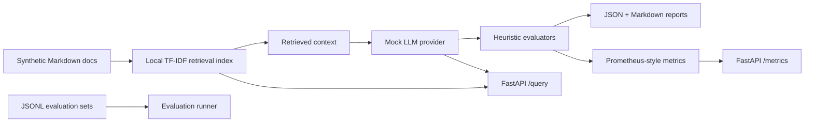

# LLMOps Portfolio

A privacy-safe public portfolio of production-style LLMOps patterns: evaluation, RAG, observability, safety checks, and deployment hygiene using synthetic data and local-first tooling.

This repository is not employer code and is not a clone of private systems. It uses synthetic documents, mock model responses, and representative patterns to make production GenAI engineering work inspectable without exposing confidential data, proprietary architectures, or customer context.

Portfolio: [paolo-notaro.github.io](https://paolo-notaro.github.io)
GitHub: [github.com/paolo-notaro](https://github.com/paolo-notaro)
LinkedIn: [linkedin.com/in/paolo-notaro](https://www.linkedin.com/in/paolo-notaro)

## Why This Exists

Production LLMOps work is often confidential: evaluation datasets, prompt systems, operational traces, incident workflows, and deployment architecture cannot usually be shared publicly. This repo provides public, inspectable evidence of the same engineering patterns through a sanitized, local-first implementation.

The goal is to show how I think about LLM evaluation, RAG quality, observability, safety, privacy, and operational constraints while keeping the implementation small enough for a reviewer to understand quickly.

## What It Demonstrates

- Local RAG over synthetic Markdown documents using TF-IDF retrieval.
- Deterministic mock LLM provider with optional environment-driven provider placeholders.
- Multi-dimensional evaluation across format, grounding, retrieval overlap, safety, refusal behavior, and latency.
- Machine-readable and human-readable evaluation reports.
- FastAPI service with a deployable frontend, `/health`, `/query`, `/evaluation/report`, `/trace/latest`, and Prometheus-style `/metrics`.
- Clean separation between retrieval, providers, evaluators, reporting, observability, and API layers.
- Privacy-safe documentation and sanitized case studies for production-style LLMOps patterns.

## Quickstart

```bash
poetry config virtualenvs.in-project false --local
poetry config virtualenvs.path .venvs --local
make install
make demo
make test
make api
```

The demo will be available at `http://127.0.0.1:8000`. Open `/app` for the customer-facing RAG assistant and `/ops` for the LLMOps console.

Example API query:

```bash
curl -s -X POST http://127.0.0.1:8000/query \
  -H "Content-Type: application/json" \
  -d '{"query": "How should a deployment rollback be handled?", "top_k": 3}'
```


## Deployable Demo UI

The FastAPI service serves two frontend surfaces:

- `/app`: customer-facing synthetic RAG assistant with cited answers, sample prompts, source cards, and refusal behavior.
- `/ops`: LLMOps / DevOps console with evaluation pass rates, latest query trace, topology, retrieval signals, latency, and Prometheus-style metrics.

The root page `/` links to both surfaces. The implementation is static HTML/CSS/JS served by FastAPI, so it deploys with the same container as the API and does not require an npm build.

## Repository Map

```text
docs/                         Sanitized architecture notes and case studies
examples/synthetic_docs/      Synthetic corpus used by the local RAG demo
examples/evaluation_sets/     JSONL evaluation examples
frontend/                     Static customer app and Ops console
src/llmops_portfolio/         Python package and FastAPI backend
tests/                        Deterministic unit tests
scripts/run_demo.py           Full local evaluation workflow
scripts/build_report.py       Report generation entry point
reports/                      Generated locally and ignored by git
```

## Architecture



## Evaluation Dimensions

- **Format compliance:** checks expected citation format and response structure.
- **Grounding / citation presence:** verifies cited synthetic documents are present in retrieved context.
- **Retrieval overlap:** measures whether expected terms appear in retrieved documents.
- **Safety keyword check:** flags prompts containing representative unsafe request patterns.
- **Refusal behavior:** verifies unsafe prompts receive a refusal-style response.
- **Latency measurement:** records provider latency and applies a local threshold.

These checks are intentionally transparent. They are not a replacement for human review, model-graded evaluation, red teaming, or production telemetry, but they show the scaffolding used to make those processes repeatable.

## Privacy And Confidentiality

All content is synthetic or sanitized. The repository intentionally avoids:

- Real customer, employer, or proprietary data.
- Private prompts, traces, logs, tickets, or incidents.
- Exact internal system designs.
- Real API calls in the default demo.
- Committed secrets or paid provider requirements.

See [docs/confidentiality.md](docs/confidentiality.md) for the full privacy posture.

## Future Work

- Add optional OpenTelemetry export for traces and spans.
- Add a small dashboard for comparing evaluation runs.
- Add provider adapters guarded by explicit environment variables and test doubles.
- Add mutation-style robustness checks for prompt injection and citation drift.
- Add CI quality gates that fail when pass rates regress below configured thresholds.
