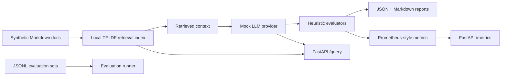

# LLMOps Portfolio

A privacy-safe public portfolio of production-style LLMOps patterns: evaluation, RAG, observability, safety checks, and deployment hygiene using synthetic data and local-first tooling.

This repository is not employer code and is not a clone of private systems. It uses synthetic documents, mock model responses, and representative patterns to make production GenAI engineering work inspectable without exposing confidential data, proprietary architectures, or customer context.

Portfolio: [paolo-notaro.github.io](https://paolo-notaro.github.io)
GitHub: [github.com/paolo-notaro](https://github.com/paolo-notaro)
LinkedIn: [linkedin.com/in/paolo-notaro](https://www.linkedin.com/in/paolo-notaro)

## Why This Exists

Production LLMOps work is often confidential: evaluation datasets, prompt systems, operational traces, incident workflows, and deployment architecture cannot usually be shared publicly. This repo provides public, inspectable evidence of the same engineering patterns through a sanitized, local-first implementation.

The goal is to show how I think about LLM evaluation, RAG quality, observability, safety, privacy, and operational constraints while keeping the implementation small enough for a reviewer to understand quickly.

## What It Demonstrates

- Local RAG over synthetic Markdown documents using TF-IDF retrieval.
- Deterministic mock LLM provider with optional environment-driven provider placeholders.
- Versioned offline quality gates over a 30-case annotated synthetic dataset.
- Rolling live request checks using clearly labeled reference-free proxies rather than accuracy claims.
- Machine-readable and human-readable evaluation reports.
- FastAPI service with a deployable frontend, stable offline snapshots, live monitoring, dataset metadata, and Prometheus-style metrics.
- Clean separation between retrieval, providers, evaluators, reporting, observability, and API layers.
- Privacy-safe documentation and sanitized case studies for production-style LLMOps patterns.

## Quickstart

```bash
poetry config virtualenvs.in-project false --local
poetry config virtualenvs.path .venvs --local
make install
make demo
make test
make api
```

The demo will be available at `http://127.0.0.1:8000`. Open `/app` for the customer-facing RAG assistant and `/ops` for the LLMOps console.

Example API query:

```bash
curl -s -X POST http://127.0.0.1:8000/query \
  -H "Content-Type: application/json" \
  -d '{"query": "How should a deployment rollback be handled?", "top_k": 3}'
```


## Deployable Demo UI

The FastAPI service serves two frontend surfaces:

- `/app`: customer-facing synthetic RAG assistant with cited answers, sample prompts, source cards, and refusal behavior.
- `/ops`: evaluation console separating versioned offline gates from rolling live request diagnostics, with annotated-dataset methodology, review queues, topology, and Prometheus-style metrics.

The offline snapshot is returned by `GET /evaluation/offline` and changes only after an explicit `POST /evaluation/offline/run`. Live customer requests are summarized by `GET /evaluation/live`. Annotation coverage and metric denominators are inspectable through `GET /evaluation/dataset`.

The root page `/` links to both surfaces. The implementation is static HTML/CSS/JS served by FastAPI, so it deploys with the same container as the API and does not require an npm build.

## Repository Map

```text
docs/                         Sanitized architecture notes and case studies
examples/synthetic_docs/      Synthetic corpus used by the local RAG demo
datasets/ground_truth/         Versioned annotated offline benchmark
examples/evaluation_sets/     Legacy compact evaluator fixtures
frontend/                     Static customer app and Ops console
src/llmops_portfolio/         Python package and FastAPI backend
tests/                        Deterministic unit tests
scripts/run_demo.py           Full local evaluation workflow
scripts/build_report.py       Report generation entry point
reports/                      Generated locally and ignored by git
```

## Architecture



## Evaluation Dimensions

The Ops console keeps two evaluation populations separate:

**Offline benchmark:** 30 manually authored synthetic cases label expected source documents, support terms, expected actions, output contracts, prompt families, perturbations, and risk tags. Retrieval F1, citation support, answer grounding, balanced policy accuracy, format compliance, and paired robustness each expose their own denominator and threshold. The snapshot is deterministic with the mock provider; local timing is reported separately.

**Live request checks:** customer-app traffic is evaluated without reference answers using evidence-support overlap, citation validity, retrieval confidence, policy consistency, and response-contract checks. These are diagnostic proxies, not factual accuracy or retrieval recall. Uncertain requests can be reviewed and promoted into future annotated regression cases.

The evaluators are intentionally transparent. They are not a replacement for human review, semantic model judges, red teaming, or production telemetry, but they make assumptions and failure signals inspectable.

## Privacy And Confidentiality

All content is synthetic or sanitized. The repository intentionally avoids:

- Real customer, employer, or proprietary data.
- Private prompts, traces, logs, tickets, or incidents.
- Exact internal system designs.
- Real API calls in the default demo.
- Committed secrets or paid provider requirements.

See [docs/confidentiality.md](docs/confidentiality.md) for the full privacy posture.

## Future Work

- Add optional OpenTelemetry export for traces and spans.
- Add persisted run history and baseline-to-candidate comparisons.
- Add provider adapters guarded by explicit environment variables and test doubles.
- Add mutation-style robustness checks for prompt injection and citation drift.
- Add CI quality gates that fail when pass rates regress below configured thresholds.
