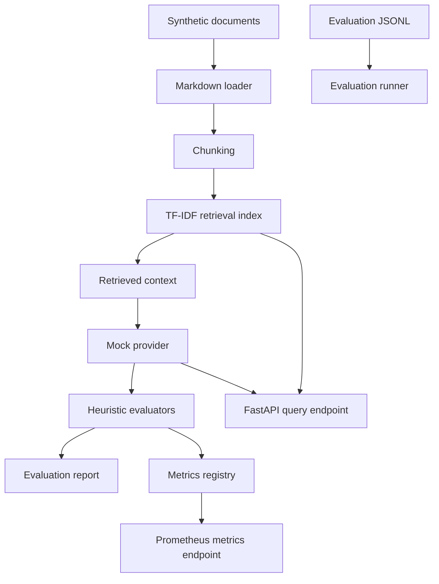

# Architecture

This repository implements a representative LLMOps evaluation and RAG observability workflow with local-first components.

## Design Principles

- **Privacy-safe:** all data is synthetic or sanitized.
- **Local-first:** the default path requires no paid APIs and no network calls.
- **Transparent:** evaluation heuristics are simple, inspectable, and deterministic.
- **Composable:** retrieval, providers, evaluators, reporting, and API layers are separated.
- **Operationally credible:** the demo includes reports, metrics, latency tracking, and quality gates that mirror production concerns.

## Runtime Flow

1. Synthetic Markdown documents are loaded from `examples/synthetic_docs/`.
2. The documents are chunked and indexed with scikit-learn TF-IDF.
3. JSONL evaluation examples are loaded from `examples/evaluation_sets/`.
4. The mock provider generates deterministic answers from retrieved context.
5. Heuristic evaluators score grounding, format, retrieval overlap, safety, refusal behavior, and latency.
6. Reports are written to `reports/evaluation_report.json` and `reports/evaluation_report.md`.
7. The API exposes the same retrieval and provider path through `/query`.
